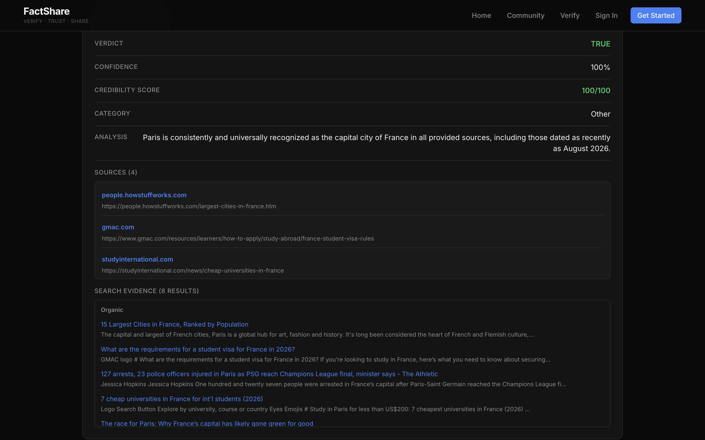
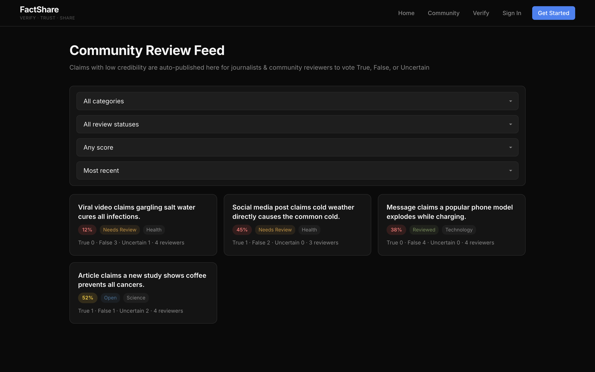
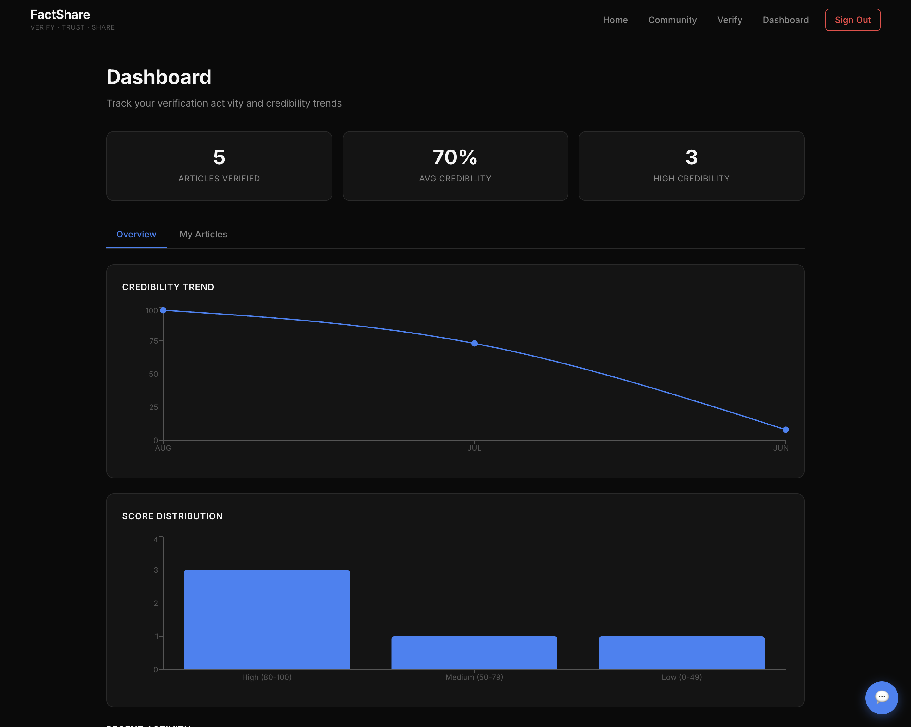
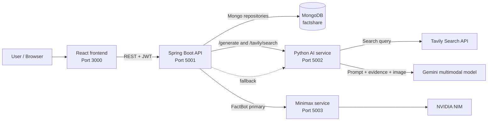
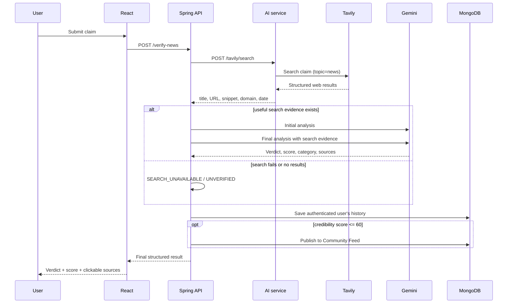
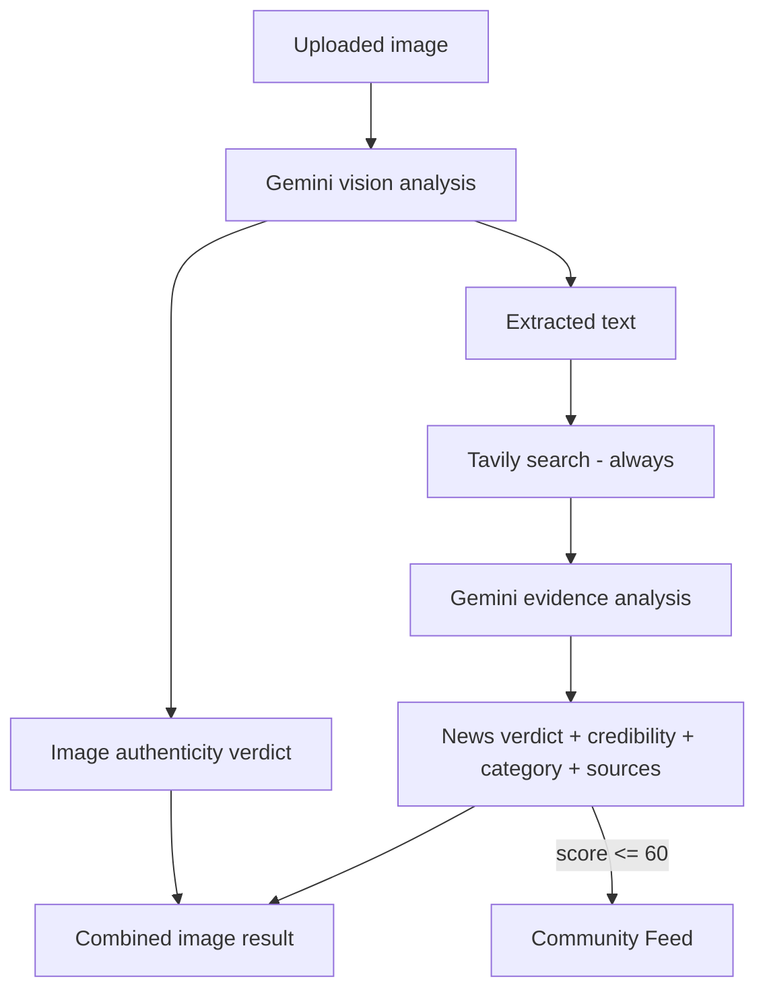
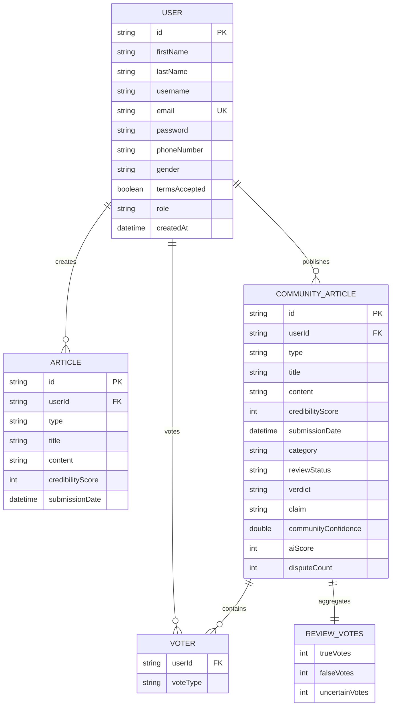

# FactShare

FactShare is a full-stack news and media verification platform that combines live web evidence, multimodal AI analysis, credibility scoring, and community review.

The system does not rely only on an AI model's pretrained knowledge for news verification. Every news claim is searched through Tavily first. The retrieved evidence is then passed to Gemini for an evidence-based verdict. Low-confidence or search-unavailable claims are automatically routed to the Community Review Feed.

> Placement focus: this repository demonstrates microservice integration, REST API design, JWT security, multimodal AI, retrieval-augmented verification, MongoDB persistence, failure handling, community consensus, and dashboard analytics.

## Table of contents

- [Working application](#working-application)
- [Problem statement](#problem-statement)
- [Core features](#core-features)
- [Technology stack](#technology-stack)
- [System architecture](#system-architecture)
- [How verification works](#how-verification-works)
- [Credibility and community review](#credibility-and-community-review)
- [Database design](#database-design)
- [API reference](#api-reference)
- [Security](#security)
- [Project structure](#project-structure)
- [Local setup](#local-setup)
- [Running and stopping the application](#running-and-stopping-the-application)
- [Build and validation](#build-and-validation)
- [Deployment](#deployment)
- [Failure handling](#failure-handling)
- [Current limitations](#current-limitations)
- [Future improvements](#future-improvements)
- [Placement and interview guide](#placement-and-interview-guide)

---

## Working application

### Home


The home page introduces the product and routes users to verification and community review.

### Evidence-based news verification



A news claim is searched through Tavily, analyzed by Gemini with the retrieved evidence, assigned a category and credibility score, and returned with clickable source URLs.

### Community Review Feed



Claims requiring human review are categorized and displayed with review status, credibility, and True/False/Uncertain vote counts.

### Dashboard



Authenticated users can track verification count, average credibility, score distribution, recent activity, and credibility trends.

---

## Problem statement

Online misinformation can appear in several forms:

- a false or misleading news claim;
- a genuine old event presented as current;
- an authentic image reused with a deceptive caption;
- an edited screenshot or manipulated image;
- a current event that an AI model cannot know without live evidence.

FactShare separates two questions that are often incorrectly combined:

1. **Is the claim supported by current web evidence?**
2. **Is the submitted text/image authentic, manipulated, or misleadingly presented?**

It answers these questions using three verification modes:

| Mode | Input | Primary question | Output |
|---|---|---|---|
| **News Claim** | Text claim/headline | Is this claim supported by live evidence? | Verdict, credibility, category, sources, search evidence |
| **Content Check** | Pasted text | Is this content authentic, manipulated, misleading, or unverifiable? | Authenticity verdict, confidence, explanation, flags |
| **Image Upload** | Image/screenshot | Is the image authentic, and is the extracted news content supported? | Image analysis plus nested news verification |

---

## Core features

- Mandatory Tavily web search for every news verification request.
- Evidence-based Gemini verdicts instead of pretrained-knowledge-only answers.
- Multimodal image understanding and text extraction through Gemini vision.
- Separate authenticity and factual-verification verdicts.
- Credibility score from 0 to 100.
- Automatic Community Feed publication for scores at or below 60.
- True, False, and Uncertain community votes.
- Community confidence blending with safeguards against one-person decisions.
- Consistent news categories and feed filters.
- JWT authentication with BCrypt password hashing.
- User verification history and analytics dashboard.
- Dark responsive React interface.
- Optional FactBot assistant using Minimax/NVIDIA with Gemini fallback.
- One-command local launcher with service logs and lifecycle management.

---

## Technology stack

| Layer | Technologies |
|---|---|
| Frontend | React 19, React Router, Axios, Recharts, DOMPurify, CSS |
| Backend | Java 21, Spring Boot 3.3.5, Spring Web, Spring Security, Spring Data MongoDB |
| AI service | Python, Flask, Google GenAI SDK, Pillow, Requests |
| Search | Tavily Search API |
| Optional chatbot service | Python, Flask, NVIDIA NIM / Minimax |
| Database | MongoDB |
| Authentication | JWT, BCrypt |
| Deployment | Docker, Render blueprint, Caddy reverse proxy |

### Default service ports

| Service | Port | Responsibility |
|---|---:|---|
| React frontend | `3000` | User interface |
| Spring Boot API | `5001` | Business logic, authentication, persistence |
| Gemini/Tavily AI service | `5002` | Multimodal model calls and web search |
| Optional Minimax service | `5003` | Primary chatbot provider |
| MongoDB | `27017` | Persistent application data |

---

## System architecture



### Component responsibilities

#### React frontend

- handles authentication and stores the JWT in `localStorage`;
- provides News Claim, Content Check, and Image Upload workflows;
- displays source URLs and Tavily evidence;
- renders community filters and voting controls;
- displays dashboard charts and history;
- sanitizes chatbot HTML using DOMPurify.

#### Spring Boot backend

- validates requests and applies security rules;
- orchestrates search and Gemini verification;
- calculates and clamps credibility scores;
- normalizes news categories;
- publishes low-scoring claims to Community Review;
- manages votes and community confidence;
- stores users, verification history, and community claims;
- generates JWTs and hashes passwords.

#### Python AI service

- is the only service that reads `GEMINI_API_KEY` and `TAVILY_API_KEY`;
- calls Tavily with a bounded timeout and retry strategy;
- normalizes web results for the Java backend;
- forwards text/image prompts to Gemini;
- validates uploaded images using Pillow.

#### MongoDB

- stores user accounts;
- stores verification history used by the Dashboard;
- stores community claims, vote counts, voters, status, and confidence.

---

## How verification works

### 1. News Claim flow



#### Mandatory search behavior

Tavily is always called before a final news verdict. The backend never treats Gemini's pretrained knowledge as sufficient evidence for a current news claim.

The AI service sends the claim as the Tavily query with these settings:

```json
{
  "query": "the submitted news claim",
  "topic": "news",
  "search_depth": "advanced",
  "max_results": 8,
  "include_answer": false,
  "include_raw_content": false,
  "include_images": false
}
```

Normalized evidence returned to the backend:

```json
{
  "title": "Result headline",
  "url": "https://source.example/article",
  "description": "Relevant content snippet",
  "domain": "source.example",
  "published_date": "2026-08-15"
}
```

Gemini receives the claim, initial analysis, result title, URL, published date, and snippet. Search evidence must influence the verdict, credibility score, explanation, category, and final sources.

### 2. Content Check flow

```text
Pasted content
    -> Gemini authenticity prompt with CURRENT_DATE
    -> AUTHENTIC / MANIPULATED / MISLEADING / UNVERIFIABLE
    -> confidence + explanation + flags
    -> authenticated user's history
```

Verdict meanings:

| Verdict | Meaning |
|---|---|
| `AUTHENTIC` | No evidence that the submitted content itself was altered |
| `MANIPULATED` | Evidence indicates that the image/text itself was edited or altered |
| `MISLEADING` | Genuine material is presented deceptively or out of context |
| `UNVERIFIABLE` | Available information is insufficient to decide |

An unusual date, date mismatch, or old event being reported again is **not** automatically treated as manipulation.

### 3. Image Upload flow



The image pipeline returns two distinct analyses:

1. the image/content authenticity result;
2. `newsAnalysis`, which runs the extracted text through the complete Tavily + Gemini news-verification pipeline.

Gemini vision reads text directly from image pixels; there is no separate Tesseract OCR service.

### 4. Authoritative current date

Every Gemini verification prompt receives:

```text
CURRENT_DATE: YYYY-MM-DD (DAY_OF_WEEK)
```

This date is generated by the backend at verification time and is authoritative. The prompt explicitly instructs the model to:

- compare dates against the injected current date;
- avoid assuming its own current date;
- avoid classifying old/reused content as manipulated without alteration evidence;
- emit `future_date` only when a date is strictly later than `CURRENT_DATE`.

---

## Credibility and community review

### AI credibility score

The evidence pass normally returns a numeric score from 0 to 100, which the backend clamps to that range.

If a numeric score is absent, the fallback mapping is:

```text
TRUE         -> confidence
FALSE        -> 100 - confidence
MISLEADING   -> max(0, 50 - confidence / 2)
Other        -> min(confidence, 50)
```

Search failure and zero-result cases use score `40`, ensuring that unverified claims enter Community Review instead of appearing verified.

### Automatic review routing

```text
credibilityScore <= 60
    -> reviewStatus = NEEDS_REVIEW
    -> publish CommunityArticle
    -> allow authenticated users to vote
```

### Community vote model

Supported review votes:

- `true`
- `false`
- `uncertain`

A user can change a vote. Submitting the same vote again removes it.

Community confidence uses a bounded weighted blend:

```text
totalVotes = trueVotes + falseVotes + uncertainVotes
communityWeight = min(0.35, totalVotes * 0.05)
truePercentage = (trueVotes / totalVotes) * 100
blendedScore = aiScore * (1 - communityWeight)
             + truePercentage * communityWeight
```

Rules:

- community influence increases by 5% per vote;
- community weight is capped at 35%;
- a single reviewer cannot decide the final verdict;
- the community verdict is applied only after at least 3 votes;
- `disputeCount = falseVotes + uncertainVotes`;
- reviewed claims receive status `REVIEWED`.

### Categories

Every claim is normalized to one of:

`Politics`, `Business`, `Technology`, `Sports`, `Entertainment`, `Science`, `Health`, `World`, `Local`, `Crime`, `Other`.

Community Feed filters support:

- category;
- review status;
- minimum and maximum credibility score;
- most recent;
- most disputed.

---

## Database design

Database: `factshare`



### `users` collection

| Field | Type | Notes |
|---|---|---|
| `_id` | String | Mongo document ID |
| `firstName`, `lastName` | String | User name |
| `username` | String | Unique username |
| `email` | String | Unique login email |
| `password` | String | BCrypt hash, never plaintext |
| `phoneNumber`, `gender` | String | Profile fields |
| `termsAccepted` | Boolean | Registration consent |
| `role` | String | Defaults to `USER` |
| `createdAt` | DateTime | Registration time |

### `articles` collection

Stores both manually submitted articles and authenticated verification history.

| Field | Type | Notes |
|---|---|---|
| `_id` | String | Mongo document ID |
| `userId` | String | Owning user |
| `type` | String | `news`, `content`, `image`, or submission type |
| `title` | String | Claim or content summary |
| `content` | String | Verification explanation/content |
| `credibilityScore` | Integer | 0–100 |
| `submissionDate` | DateTime | Used by history and Dashboard |

### `communityArticles` collection

| Field | Type | Notes |
|---|---|---|
| `_id`, `userId` | String | Claim ID and submitter |
| `type`, `title`, `content`, `claim` | String | Claim data |
| `credibilityScore`, `aiScore` | Integer | Current blended score and original AI score |
| `communityConfidence` | Double | Unrounded blended confidence |
| `category` | String | Canonical category |
| `reviewStatus` | String | `OPEN`, `NEEDS_REVIEW`, or `REVIEWED` |
| `verdict` | String | AI/community verdict |
| `submissionDate` | DateTime | Feed order |
| `disputeCount` | Integer | False + Uncertain votes |
| `communityVotes` | Object | `trueVotes`, `falseVotes`, `uncertainVotes` |
| `voters` | Array | `{userId, voteType}` per reviewer |
| `votes` | Object | Legacy `upvotes`/`downvotes` compatibility |

Mongo relationships are stored as IDs rather than database-enforced joins. Spring services coordinate consistency.

---

## API reference

### Authentication and access rules

- Public: registration, login, chat, verification, and `GET /community/articles`.
- JWT required: article history, dashboard statistics, community publishing, and voting.
- Optional authentication on verification allows logged-in results to be saved to history. Anonymous results use `system` and are not added to a user's Dashboard.

Send authenticated requests with:

```http
Authorization: Bearer <JWT>
```

### Public/user-facing endpoints

| Method | Endpoint | Auth | Request | Main response |
|---|---|---|---|---|
| `POST` | `/register` | Public | Registration fields | Status and message |
| `POST` | `/login` | Public | `email`, `password` | JWT, user ID, username |
| `POST` | `/verify-news` | Optional | `claim` | Evidence verdict and score |
| `POST` | `/verify-image` | Optional | `imageText` | Authenticity result |
| `POST` | `/verify-image-upload` | Optional | Multipart `image` | Image result + `newsAnalysis` |
| `POST` | `/chat` | Public | `question` | Sanitizable HTML response |
| `GET` | `/community/articles` | Public | Query filters | Community claim list |
| `POST` | `/community/articles` | JWT | Claim body | Created community claim |
| `POST` | `/community/articles/{id}/vote` | JWT | `voteType` | Updated community claim |
| `POST` | `/submit-article` | JWT | `type`, `title`, `content` | Saved/scored article |
| `GET` | `/article-history` | JWT | None | User article history |
| `GET` | `/stats/user` | JWT | None | Dashboard metrics |
| `GET` | `/dashboard` | JWT | None | Authenticated welcome/status |

### Endpoint details

#### `POST /register`

```json
{
  "firstName": "Demo",
  "lastName": "User",
  "username": "demouser",
  "email": "demo@example.com",
  "password": "strong-password",
  "phoneNumber": "0000000000",
  "gender": "Prefer not to say",
  "termsAccepted": true
}
```

Required fields are validated. Passwords are BCrypt-hashed before storage.

#### `POST /login`

```json
{
  "email": "demo@example.com",
  "password": "strong-password"
}
```

Returns:

```json
{
  "status": "success",
  "message": "Login successful",
  "token": "<JWT>",
  "userId": "<id>",
  "username": "demouser"
}
```

#### `POST /verify-news`

```json
{
  "claim": "A news claim to verify"
}
```

Representative response:

```json
{
  "claim": "A news claim to verify",
  "verdict": "TRUE",
  "confidence": 94,
  "credibilityScore": 92,
  "credibilityScoreSource": "evidence",
  "category": "World",
  "explanation": "Evidence-based analysis...",
  "sources": ["https://source.example/article"],
  "searchEvidence": {
    "total": 5,
    "results": {
      "organic": [
        {
          "title": "Source headline",
          "url": "https://source.example/article",
          "description": "Relevant snippet",
          "domain": "source.example",
          "published_date": "2026-08-15"
        }
      ]
    }
  },
  "communityFeed": false
}
```

Possible news verdicts: `TRUE`, `FALSE`, `MISLEADING`, `UNVERIFIABLE`, `UNVERIFIED`, `SEARCH_UNAVAILABLE`.

#### `POST /verify-image`

```json
{
  "imageText": "Pasted suspicious content"
}
```

Returns `extracted_text`, authenticity `verdict`, `confidence`, `explanation`, and `flags`.

#### `POST /verify-image-upload`

```bash
curl -X POST http://localhost:5001/verify-image-upload \
  -F "image=@screenshot.jpg"
```

Accepted by the frontend: PNG, JPEG, BMP, GIF, and WebP, up to 10 MB. The response includes authenticity fields and, when text is extracted, nested `newsAnalysis`.

#### `GET /community/articles`

Supported query parameters:

| Parameter | Example | Meaning |
|---|---|---|
| `category` | `Health` | Exact normalized category |
| `status` | `NEEDS_REVIEW` | Review status |
| `minScore` | `0` | Minimum credibility |
| `maxScore` | `60` | Maximum credibility |
| `sort` | `recent` or `disputed` | Feed ordering |

Example:

```http
GET /community/articles?category=Health&maxScore=60&status=NEEDS_REVIEW&sort=disputed
```

#### `POST /community/articles/{id}/vote`

```json
{
  "voteType": "uncertain"
}
```

Review values: `true`, `false`, `uncertain`. Legacy `upvote` and `downvote` are also supported for compatibility.

#### `GET /stats/user`

Returns:

```json
{
  "totalArticles": 5,
  "avgCredibility": 70,
  "credibilityTrend": [
    {"name": "AUG", "credibility": 81}
  ],
  "scoreDistribution": [
    {"name": "High (80-100)", "score": 3},
    {"name": "Medium (50-79)", "score": 1},
    {"name": "Low (0-49)", "score": 1}
  ],
  "recentArticles": []
}
```

### Internal AI-service endpoints

These endpoints are called by Spring Boot, not directly by the browser.

| Method | Endpoint | Purpose |
|---|---|---|
| `POST` | `:5002/generate` | Gemini text or image generation |
| `POST` | `:5002/tavily/search` | Tavily news search and normalization |
| `POST` | `:5003/generate` | Optional Minimax/NVIDIA chatbot generation |

Tavily behavior:

- timeout: 12 seconds per attempt;
- up to 3 attempts with short backoff for transient connection resets;
- no Tavily-generated answer is used;
- empty/failure responses are not treated as verified evidence.

---

## Security

- BCrypt password hashing.
- JWT authentication with 24-hour expiry by default.
- Stateless Spring Security session policy.
- API keys remain in the Python service environment and are never returned to clients.
- Browser requests never send Gemini/Tavily keys.
- CORS origins are configurable.
- DOMPurify sanitizes chatbot HTML before rendering.
- Image size is limited to 10 MB.
- Server-side verdict normalization prevents unexpected model labels.
- Credibility scores are clamped to 0–100.
- Search failure cannot silently fall back to AI memory.

> Production requirement: use a strong unique `JWT_SECRET`, protect `.env`, use HTTPS, rotate keys, and do not commit credentials.

---

## Project structure

```text
FactShare/
├── README.md
├── run.py                         # One-command launcher
├── .env                           # Local secrets (never commit)
├── Caddyfile                      # Reverse proxy/TLS configuration
├── Dockerfile                     # Backend container build
├── render.yaml                    # Render deployment blueprint
├── docs/
│   └── screenshots/
│       ├── home.png
│       ├── verify.png
│       ├── community.png
│       └── dashboard.png
├── frontend/
│   ├── package.json
│   └── src/
│       ├── App.js
│       ├── apiConfig.js
│       ├── components/
│       │   ├── Navbar.js
│       │   └── Chatbot.js
│       ├── pages/
│       │   ├── Home.js
│       │   ├── Login.js
│       │   ├── Register.js
│       │   ├── SubmitArticle.js
│       │   ├── Community.js
│       │   └── Dashboard.js
│       └── styles/global.css
├── backend-spring/
│   ├── pom.xml
│   └── src/main/
│       ├── java/com/factshare/
│       │   ├── controller/        # REST controllers
│       │   ├── service/           # Verification/business logic
│       │   ├── model/             # Mongo documents
│       │   ├── repository/        # Spring Data repositories
│       │   ├── dto/               # Request/response DTOs
│       │   ├── security/          # JWT filter/configuration
│       │   └── config/
│       └── resources/application.properties
└── ai-service/
    ├── gemini_service.py          # Gemini + Tavily bridge
    ├── minimax_service.py         # Optional chatbot provider
    ├── requirements.txt
    ├── Dockerfile
    └── Dockerfile.minimax
```

---

## Local setup

### Prerequisites

| Tool | Recommended minimum |
|---|---|
| Java JDK | 21 |
| Maven | 3.9+ |
| Node.js | 18+ |
| npm | Bundled with Node.js |
| Python | 3.10+ |
| MongoDB | 4.4+ |

### Environment configuration

Create a root `.env` file:

```env
MONGO_URI=mongodb://localhost:27017/factshare
JWT_SECRET=replace_with_a_strong_secret_at_least_32_characters
PORT=5001

GEMINI_SERVICE_URL=http://localhost:5002
MINIMAX_SERVICE_URL=http://localhost:5003

GEMINI_API_KEY=your_gemini_api_key
TAVILY_API_KEY=your_tavily_api_key

# Optional FactBot primary provider
NVIDIA_API_KEY=your_nvidia_api_key
```

Do not expose or commit real key values.

### First-time installation

The launcher can install dependencies automatically:

```bash
python3 run.py
```

Manual setup, if preferred:

```bash
# Python
cd ai-service
python3 -m venv .venv
.venv/bin/pip install -r requirements.txt

# Backend
cd ../backend-spring
mvn -q -DskipTests package

# Frontend
cd ../frontend
npm install
```

---

## Running and stopping the application

### One-command start

```bash
python3 run.py
```

Useful launcher flags:

```bash
python3 run.py --open          # Open browser after startup
python3 run.py --no-mongo      # Use an already-running MongoDB
python3 run.py --no-minimax    # Skip optional Minimax service
python3 run.py --skip-setup    # Skip dependency/build setup
python3 run.py --watch         # Run backend in watch/development mode
```

Logs are written to `.run-logs/`.

### Manual start

```bash
# Terminal 1: MongoDB
mongod --dbpath ./data/db

# Terminal 2: Gemini/Tavily service
cd ai-service
.venv/bin/python gemini_service.py

# Terminal 3: optional Minimax service
cd ai-service
.venv/bin/python minimax_service.py

# Terminal 4: Spring Boot
cd backend-spring
mvn spring-boot:run

# Terminal 5: React
cd frontend
npm start
```

### Stop

When running the launcher in the foreground, press `Ctrl+C`; it manages child-process shutdown.

For separately launched local processes, terminate the relevant Java, Flask, React, and MongoDB processes gracefully.

---

## Build and validation

### Backend

```bash
cd backend-spring
mvn -q -DskipTests package
```

> No backend test suite is currently included. Add tests under `backend-spring/src/test/` before using `mvn test` as a validation gate.

Generated JAR:

```text
backend-spring/target/factshare-api-1.0.0.jar
```

### Frontend

```bash
cd frontend
npm test
npm run build
```

### Python syntax check

```bash
python3 -m py_compile ai-service/gemini_service.py
python3 -m py_compile ai-service/minimax_service.py
```

### Basic health checks

The services do not expose dedicated root health endpoints, so these status codes are expected:

- frontend `/` -> `200`;
- backend `/` -> `403` because Spring Security protects unmatched routes;
- AI-service `/` -> `404` because no root route is defined.

---

## Deployment

### Render

`render.yaml` defines separate services for:

- Spring API;
- Gemini/Tavily Python service;
- optional Minimax service;
- static React frontend.

Set secrets in the deployment provider, not in source control.

### Docker

- root/backend Dockerfile builds the Spring Boot application with Maven and runs it on a Java 21 JRE;
- `ai-service/Dockerfile` runs the Gemini/Tavily service;
- `ai-service/Dockerfile.minimax` runs the optional Minimax service.

### Caddy

The included `Caddyfile` supports TLS, SPA fallback, security headers, and reverse-proxying backend routes for a single-domain deployment.

---

## Failure handling

| Failure | Behavior |
|---|---|
| Missing Tavily key | AI service returns 401; backend produces `SEARCH_UNAVAILABLE` |
| Tavily timeout/reset | Up to 3 bounded attempts; then `SEARCH_UNAVAILABLE` |
| Tavily zero results | `UNVERIFIED` |
| Evidence exists but Gemini analysis fails | `UNVERIFIED` |
| Missing Gemini key | AI service returns 401 |
| Gemini rate limit | AI service returns 429 |
| Invalid image | AI service returns 400; controller returns an unverifiable response |
| MongoDB unavailable | Persistence/auth endpoints fail; launcher reports startup failure |
| Minimax unavailable | FactBot falls back to Gemini |
| Unknown AI verdict label | Backend normalizes to `UNVERIFIABLE` |

Unverified/search-unavailable results receive score 40 and are sent to Community Review rather than being presented as verified facts.

---

## Current limitations

- The stored user role is not yet enforced by Spring Security; currently any authenticated user can vote, not only verified journalists.
- Tavily evidence is normalized into one `organic` result bucket.
- Search query construction currently uses the entire claim without separate keyword/entity extraction.
- There is no pagination for community feed or article history.
- Community vote updates are not implemented with MongoDB atomic update operators; high-concurrency deployments should add optimistic locking or transactions.
- Dashboard trend groups by month abbreviation without year.
- Multimodal authenticity analysis is model-based, not dedicated pixel-forensics.
- Image text extraction uses Gemini vision rather than a separate OCR engine.
- Content Check does not run Tavily; only News Claim and the image's nested `newsAnalysis` use mandatory web evidence.
- Public verification endpoints can be used anonymously; anonymous checks are not saved to a user Dashboard.
- Automated test coverage is currently limited.

---

## Future improvements

- Enforce `REVIEWER`/`JOURNALIST` roles for community voting.
- Add reviewer verification and reputation scoring.
- Add pagination, full-text search, and MongoDB indexes.
- Add atomic vote updates and optimistic locking.
- Add source-quality scoring and domain reputation.
- Preserve Tavily relevance scores in normalized evidence and expose them to Gemini/UI.
- Add dynamic Tavily date filters for current vs historical claims.
- Add dedicated OCR and forensic image-analysis services.
- Add explainable claim-evidence mapping and source agreement visualization.
- Add unit, integration, API contract, and end-to-end tests.
- Add observability: structured logs, metrics, tracing, health endpoints, and alerts.
- Add rate limiting and request quotas for public AI endpoints.

---

## Placement and interview guide

### 30-second project explanation

> FactShare is a retrieval-augmented news verification platform. A React client sends claims to a Spring Boot API. The API always retrieves live news evidence through a Python Tavily service and passes that evidence to Gemini for a verdict, credibility score, category, and source URLs. Low-scoring or search-unavailable claims are automatically published to a MongoDB-backed community review feed, where authenticated users vote True, False, or Uncertain. JWT authentication, multimodal image analysis, failure-safe verification, and dashboard analytics complete the system.

### Important design decisions to explain

1. **Why Tavily before Gemini?**  
   Current-event verification requires fresh evidence. The system refuses to use model memory as a substitute when search fails.

2. **Why a separate Python AI service?**  
   It isolates provider SDKs and API keys, allows independent scaling, and keeps the Java backend focused on domain rules and persistence.

3. **Why distinguish manipulated and misleading?**  
   A genuine image can still be misleading when reused out of context. Manipulation should require evidence that the content itself was altered.

4. **Why route low scores to community review?**  
   Automation is uncertain. Human consensus provides a second layer without allowing a single vote to dictate the outcome.

5. **How is one-vote dominance prevented?**  
   Community weight grows gradually, is capped at 35%, and verdict replacement requires at least three votes.

6. **How are secrets protected?**  
   Gemini and Tavily keys exist only in the Python service environment; the browser and Java service never receive them.

7. **How does the system fail safely?**  
   Search errors produce `SEARCH_UNAVAILABLE`; no results produce `UNVERIFIED`; both are sent to Community Review rather than presented as facts.

### Resume-ready description

> Built a full-stack misinformation verification platform using React, Spring Boot, Flask, MongoDB, Tavily Search, and Gemini multimodal AI. Implemented mandatory retrieval-augmented verification, JWT/BCrypt security, credibility scoring, image/content analysis, evidence source rendering, community consensus with bounded vote influence, and dashboard analytics.

### Concepts demonstrated

- REST and layered backend architecture;
- microservice orchestration;
- retrieval-augmented generation (RAG);
- multimodal AI integration;
- JWT authentication and password security;
- MongoDB document modeling;
- resilience and graceful degradation;
- explainable evidence and source attribution;
- human-in-the-loop verification;
- data visualization and frontend state management.

---

## License

No license file is currently included. Add a license before public distribution.
